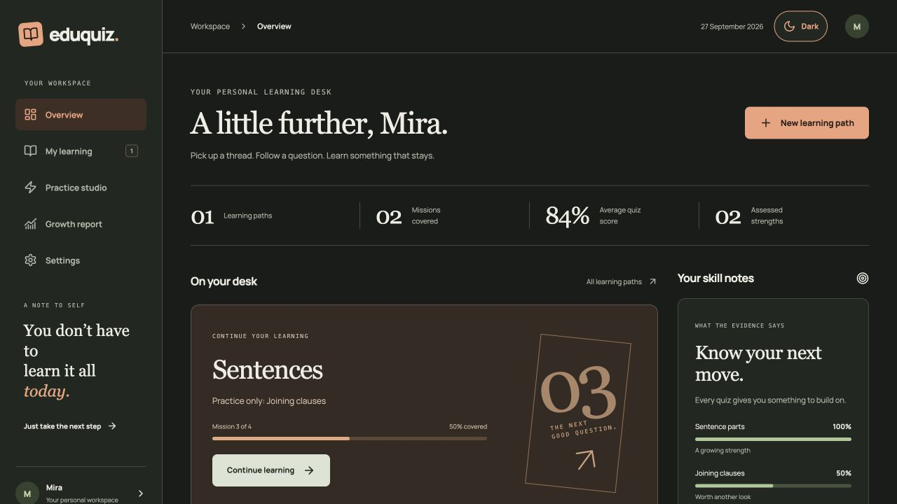
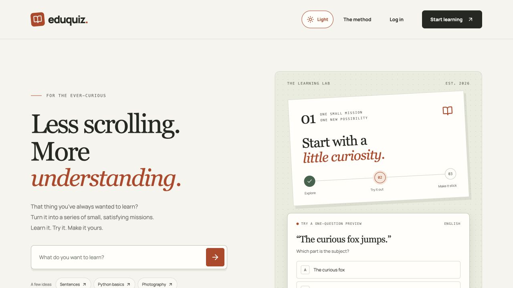
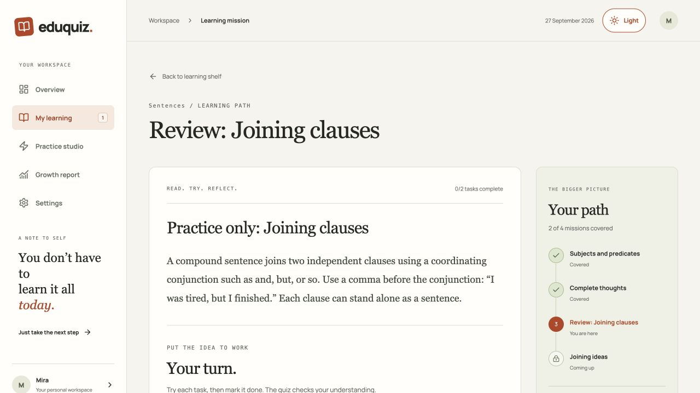
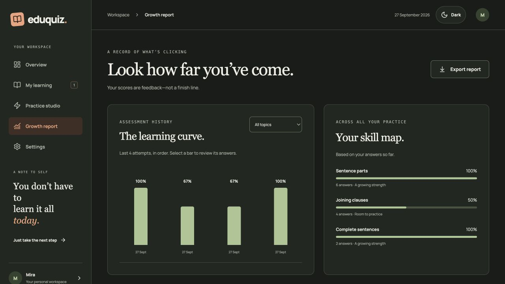
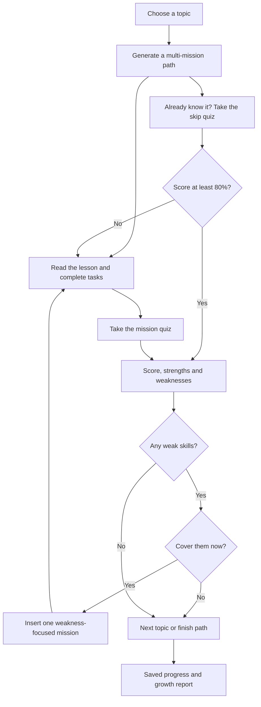
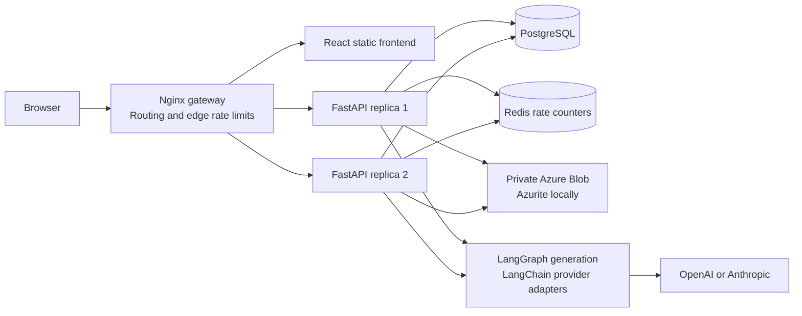

<div align="center">

# EduQuiz

### Less scrolling. More understanding.

Turn a question into a learning path: **learn → try → check → adapt.**

**React + TypeScript** · **FastAPI** · **LangChain + LangGraph** · **PostgreSQL** · **Redis** · **Azure Blob / Azurite**

[Start locally](#start-locally) · [Explore the app](#explore-the-app) · [Learning flow](#how-learning-adapts) · [Architecture](#architecture) · [Project docs](#project-docs)

</div>



> **A working adaptive-learning MVP.** Bring an OpenAI or Anthropic key, or try the local **sentences** and **paragraphs** demos without a key. Choose whether to revisit weak skills, take a standalone quiz, or move on to the next topic.

## Explore the app

<table>
<tr>
<td width="50%"><strong>01 / Follow a question</strong><br/>Choose a topic from the landing page and start a personal learning path.<br/><br/><a href="doc/assets/landing-light.jpg"></a></td>
<td width="50%"><strong>02 / Take the next small step</strong><br/>Read a lesson, try its tasks and follow a roadmap that can adapt to your results.<br/><br/><a href="doc/assets/mission-light.jpg"></a></td>
</tr>
</table>

<details>
<summary><strong>03 / Open the growth report — scores, skill evidence and answer review</strong></summary>



Select a score bar inside the app to review that attempt. Filter the history by topic, inspect strengths and gaps, or export your report as JSON. Skill summaries combine evidence across attempts; scores are feedback, not certification.

</details>

<details>
<summary><strong>Light or dark? Make the desk yours</strong></summary>

The sun/moon switch lives in the landing-page and workspace headers. It starts with your device theme, remembers your choice, and works with a keyboard. Dark styling extends to lessons, quizzes, feedback, forms, dialogs and admin screens.

All four images are real captures of the local app on **27 September 2026**, using the synthetic learner **Mira** and the deterministic demo curriculum. The numbers illustrate the interface, not a claim about learning effectiveness. Click a screenshot to view it at full size.

[Browse screenshot files and capture notes](doc/assets/README.md)

</details>

## What you can do

| Area | Implemented functionality |
| :--- | :--- |
| **Your learning desk** | Resume a path, see covered missions, average quiz score, recent attempts and assessed strengths. |
| **Adaptive missions** | Generate a multi-mission path with lessons, practical checklists and multiple-choice quizzes. |
| **Quiz feedback** | Receive a server-calculated score, skill-specific strengths/weaknesses, correct answers and explanations. |
| **Fresh quiz order** | Returning from the lesson starts a shuffled quiz with cleared selections. Refreshing keeps the current order and answers. |
| **Topic completion** | Review a suggested next topic, explicitly accept to start it, dismiss it, or return home. |
| **Skip challenge** | Skip a mission only after passing its quiz with **at least 80%**. A failed skip returns you to the lesson. |
| **Focused follow-up** | Accept a weakness-only mission before the next topic, or decline and continue. |
| **Practice studio** | Take a one-mission practice quiz without starting a full learning path. |
| **Learning library** | Search topics, filter in-progress/completed paths and revisit completed results. From results, choose a specific mission for a lesson-only recap—no tasks, quiz or progress changes. |
| **Growth report** | View score charts, filter assessment history, inspect skill evidence and download a private report snapshot. |
| **Your profile** | Click the top-right avatar to edit your display name, choose an icon and save a short bio to your account. |
| **Account & model settings** | Sign up/in, connect or remove a provider key, select a model, and log out of all devices. |
| **Comfort & continuity** | Light/dark themes, an on-demand sliding sidebar with a pinned Log out button, gentle dialog/page transitions that respect reduced motion, keyboard-accessible dialogs, per-tab task/answer drafts and recoverable pending assessment results. |
| **Administration** | Browse users and audit events, suspend/restore learners and paginate each list independently. Admin accounts are protected from this suspension control. |

### Two roles, clear boundaries

| Learner | Administrator |
| :--- | :--- |
| Own paths, attempts, reports and model connection | Learner capabilities plus user-account and audit views |
| Choose topics and remediation | Suspend or restore learner access |
| No access to other learners’ records | Provisioned through a private operator command |

## How learning adapts



**One topic is a path, not a single prompt.** The normal generator chooses 2–8 chapters based on scope, difficulty and importance; a practice quiz or a targeted follow-up requests one. Quiz size varies from 3–8 questions according to each chapter’s difficulty and importance. The local sentences demo has three chapters (3, 4 and 6 questions); paragraphs has two (3 and 5).

<details>
<summary><strong>Walk through an example: learning sentences</strong></summary>

1. Start **Sentences** and work through subjects and predicates.
2. Complete the lesson tasks and answer the quiz.
3. Suppose you understand sentence parts but miss questions about joining clauses. Your result identifies that specific gap.
4. Choose **Work on these skills** to insert a joining-clauses review before the next topic, or **Continue to next topic** to keep moving.
5. Review the evidence later in your growth report.

Ordinary quiz completion and mastery are separate: a learner can choose to continue after a low score. The **80% gate applies to skipping**. Standalone practice ends after its assessment and does not insert remediation missions.

</details>

## Start locally

**You need:** Git, Python 3 to generate local secrets, and Docker Engine/Desktop with Docker Compose running. Node and a local Python backend environment are optional for source development; the Compose build supplies its own runtimes.

```sh
git clone https://github.com/ojas2005/EduQuiz.git
cd EduQuiz
python3 scripts/setup_env.py
docker compose up --build -d
```

Open **[localhost:8080](http://localhost:8080)**. This repository is private, so cloning requires access through your GitHub credentials.

### Your first learning path

1. Create an account.
2. Select **New learning path** and enter **sentences**.
3. Try a mission, submit its quiz and explore the result.
4. Open **Practice studio** for a quiz on its own, or **Growth report** to review your progress.

The setup script creates a Git-ignored `.env` with fresh local secrets and restricted file permissions. If `.env` already exists, it leaves the file unchanged; continue to the Compose command. There are no default user or admin passwords.

<details>
<summary><strong>Connect your own model</strong></summary>

Open **Settings → Your AI connection**:

1. Select **OpenAI** or **Anthropic**.
2. Enter the exact model ID available in your provider account.
3. Save your API key, then create a learning path for another topic.

The current adapters support these two providers, not arbitrary API endpoints. Saving stores the encrypted key; it does not test model availability. Generation errors appear in the app so you can correct the configuration. Provider usage is billed to your own account.

Keys belong in the app’s server-backed Settings flow. **Do not put provider keys in React/Vite variables or commit them to Git.**

</details>

<details>
<summary><strong>Provision an administrator</strong></summary>

Register the intended account first, then run:

```sh
docker compose exec api1 python -m app.manage make-admin --email admin@example.com
```

Replace the example email with that registered account. Reload the app to see **Administration**. Public signup cannot choose or promote an administrator role.

</details>

<details>
<summary><strong>Common commands and troubleshooting</strong></summary>

```sh
# Inspect services and recent API logs
docker compose ps
docker compose logs --tail=100 api1 api2

# Check API health
curl http://localhost:8080/api/health

# Rebuild after frontend changes
docker compose up -d --build frontend

# Stop the stack while retaining its named volumes
docker compose down
```

| Symptom | First check |
| :--- | :--- |
| Docker cannot connect | Start Docker Desktop/Engine, then rerun Compose. |
| Page does not load | Check `docker compose ps`; wait for API health checks and gateway startup. |
| A non-demo topic cannot generate | Configure a supported provider and model in Settings. |
| Too many requests | Wait for the rate window to reset; repeated retries also count. |
| A rebuilt frontend returns a gateway error | Restart the gateway with `docker compose restart gateway` so it resolves the recreated container. |
| UI looks stale after a rebuild | Refresh the browser page. |

`docker compose down` preserves local data. Adding `--volumes` deletes the named database, Redis and blob volumes; it is not a routine restart step.

</details>

## Architecture



| Layer | Responsibility |
| :--- | :--- |
| **React 19 / TypeScript / Vite** | Learning workspace, quizzes, reports, administration and theme-aware UI. |
| **FastAPI / SQLAlchemy** | Authentication, authorization, deterministic grading and progression. |
| **LangChain / LangGraph / Pydantic** | Provider adapters and structured curriculum generation with schema validation. |
| **PostgreSQL 17** | Users, sessions, encrypted credentials, curricula, assessment attempts and audit records. |
| **Redis 7** | Shared atomic rate-limit counters across API replicas. |
| **Azure Blob / Azurite** | Private JSON report snapshots; local object-storage emulation. |
| **Nginx / Docker Compose** | Same-origin serving, security headers, edge limits and least-connections API balancing. |

The model generates lesson content. **The server owns scoring and progression.** LangGraph currently wraps a validated generation step; the application’s transactional API code handles the adaptive learning decisions. Local API replicas share state, but the single gateway and data services mean this Compose stack is not a high-availability production deployment.

## Security in the current build

<details>
<summary><strong>Expand authentication, data protection and abuse controls</strong></summary>

| Control | Implementation |
| :--- | :--- |
| Password storage | Argon2 password hashing; no plaintext passwords stored. |
| Access tokens | 15-minute JWTs held in frontend memory, tied to a revocable server session. |
| Refresh tokens | Rotating HttpOnly, SameSite=Strict cookies with a seven-day absolute session lifetime and replay detection. |
| Revocation | Logout and suspension revoke sessions; authenticated requests check server session state. |
| Authorization | Server-enforced ownership and user/admin roles. |
| Provider credentials | Fernet encryption at rest; API responses expose metadata, not the saved key. |
| Assessment integrity | Unanswered quiz payloads omit answer keys; the server grades and checks the current mission. |
| Abuse controls | Nginx edge limits plus shared Redis budgets; generation is limited to five requests per user per hour. |
| Browser boundary | Same-origin deployment, origin checks on cookie authentication routes, CSP and other security headers. |
| Local exposure | Only the gateway is published, on loopback port 8080; database, cache and blob services have no host ports. |

For deployment, use HTTPS, `SECURE_COOKIES=true`, the exact public `ORIGIN`, and `DEMO_MODE=false`, alongside the production controls in the architecture document. The generated local configuration intentionally uses HTTP and `SECURE_COOKIES=false`.

This is implemented protection for an MVP, not a security certification. Production migrations, stronger infrastructure identity, recovery, admin MFA and operational readiness remain release work.

</details>

## Develop and verify

<details>
<summary><strong>Frontend development</strong></summary>

Use Node 22+:

```sh
cd frontend
npm ci
npm run dev
npm run build
```

Vite proxies `/api` to `localhost:8000`. For a separate development server, run the backend there with reachable PostgreSQL/Redis/blob settings and `ORIGIN=http://localhost:5173`. The default Compose setup does not publish those internal services; use the complete Compose origin for the simplest working environment.

</details>

<details>
<summary><strong>Backend tests and integration checks</strong></summary>

The backend supports Python 3.11+; the container uses 3.12. From the repository root:

```sh
cd backend
python3.12 -m venv .venv
.venv/bin/pip install -r requirements.lock.txt
.venv/bin/python -m pytest tests/test_learning.py
cd ..

# Requires the running Compose stack in local demo mode
python3 scripts/integration_test.py
```

Unit tests cover grading and demo schema behavior without provider calls. The integration script exercises auth, ownership, skip gating, remediation, practice, reporting, credentials, rate limits, session revocation and admin controls. It creates synthetic accounts and persistent test records.

**Recorded validation:** production frontend builds, backend unit tests, shuffle tests, integration checks and browser flows have passed. Real-provider generation, load benchmarks and a formal accessibility/security audit have not been completed. See the dated [validation record](doc/VALIDATION.md) for the exact scope; these are recorded checks, not a live CI badge.

</details>

## Project docs

| Read this | For this |
| :--- | :--- |
| [Product requirements](doc/PRD.md) | User journeys, feature requirements, scope and roadmap. |
| [Technical specification](doc/TSP.md) | API contracts, assessment rules and security behavior. |
| [Architecture](doc/ARCHITECTURE.md) | Trust boundaries, sequence diagrams, concurrency and deployment evolution. |
| [Design system](design-system/eduquiz/MASTER.md) | Editorial visual direction, theme tokens and interaction decisions. |
| [Validation record](doc/VALIDATION.md) | What was tested and what still needs verification. |
| [History provenance](doc/HISTORY.md) | How the initial phased commit history was organized. |

<details>
<summary><strong>Repository map</strong></summary>

```text
EduQuiz/
├── frontend/              React app, theme controls and static serving
│   ├── src/components/    Shared UI and theme switch
│   ├── src/pages/         Landing, dashboard, missions, reports, settings, admin
│   └── public/            Early theme initialization
├── backend/
│   ├── app/               API, auth, models, generation and storage
│   └── tests/             Grading and schema checks
├── doc/                   PRD, TSP, architecture and validation
│   └── assets/            Real app screenshots
├── design-system/         Product design decisions
├── infra/                 Gateway configuration
├── scripts/               Local secret setup and integration checks
└── compose.yaml           Reproducible local stack
```

</details>

## Next milestones

- [x] Multi-mission paths, quizzes, skip gating and targeted remediation
- [x] Practice studio, growth reports and private exports
- [x] User/admin roles, sessions, rate limits and local API balancing
- [x] Responsive editorial UI and persistent light/dark mode
- [ ] Evaluate real-provider generation quality and model compatibility
- [ ] Add versioned migrations and durable generation jobs
- [ ] Add account recovery, email verification and admin MFA
- [ ] Establish canonical skill labels and content-review workflows
- [ ] Complete accessibility review, load tests, backups and restore drills

<div align="center">

**Keep asking good questions.**
[Back to top](#eduquiz) · [Start locally](#start-locally) · [Read the PRD](doc/PRD.md)

</div>
