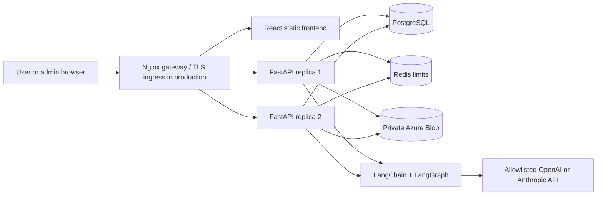
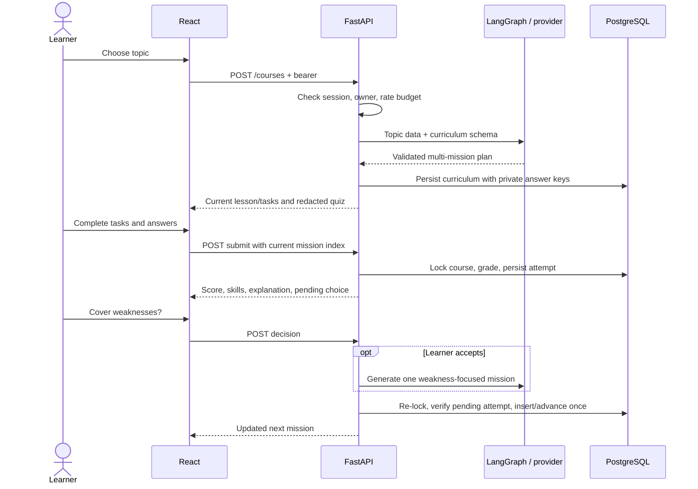
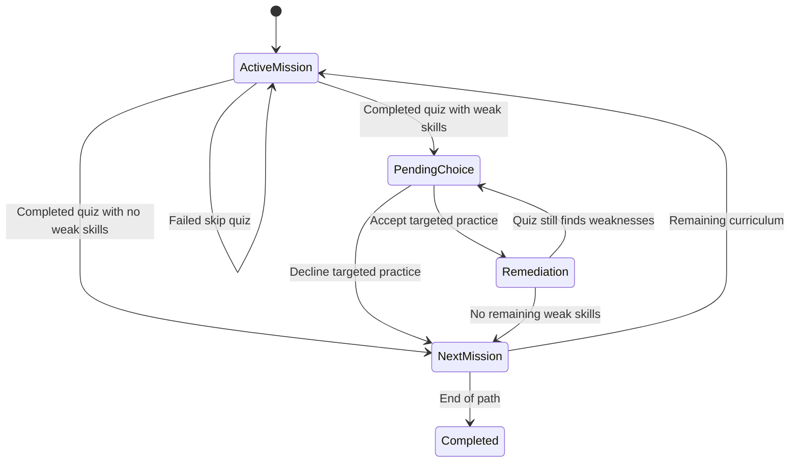

# EduQuiz — Architecture

Version 0.1 · 26 September 2026

## System context

The browser and API share one origin. No provider credentials or answer keys are sent to client code. The model sees only topic/focus context; it has no access to the user database or action tools. API replicas share PostgreSQL and Redis, so ordinary requests do not need sticky sessions. Auth still performs a session lookup, allowing immediate logout and suspension enforcement.

## Container layout
- `gateway`: loopback port 8080, routing, edge limits, security headers, least-connections balancing.
- `frontend`: static production Vite build served by Nginx.
- `api1`, `api2`: identical unprivileged Python 3.12 images; FastAPI endpoints and LangGraph generation.
- `init`: one-shot explicit schema initialization before APIs become available.
- `postgres`: authoritative durable state with named volume.
- `redis`: shared atomic limit counters, AOF volume and no-eviction policy; failure blocks rate-limited actions.
- `blob`: Azurite private blob emulator with named volume; no public host port.
- `blob-init`: creates the private report container once, safe to repeat.

Compose is a reproducible development topology, not a highly available production deployment: one gateway and one instance of each state service remain failure points.

## Learning sequence

## State machine

“Completed quiz” here means ordinary assessment submission or a passing skip challenge. Completion and mastery are separate: learners can choose to continue after weak performance on a normal quiz. Practice has a separate one-mission path and completes after submission without remediation.

## Trust boundaries
Browser input is untrusted, including mission index, role, completion claims, model ID and topic. The server owns scoring, authorization, answer keys and sequence changes. Provider output is also untrusted: constrained and validated before persistence and rendered as escaped text. Schema correctness does not establish educational accuracy. The blob store is private; exports are authorized server-side and downloaded through the API response rather than exposing its internal address.

## Concurrency and consistency
Quiz submissions acquire a row lock on the owned course. Pending decisions and mission index checks reject duplicate transitions once the course changes. Generation runs outside the final decision lock, then the pending attempt is rechecked under lock. This avoids duplicate inserted missions but does not guarantee exactly-once provider charging. Failed skip retries may record multiple attempts by design. Refresh rotation locks the session row and retains old hashes to detect replay. Signup uniqueness relies on a database constraint.

API sync SQLAlchemy calls within async generation routes can occupy event-loop time briefly; these routes also hold a DB session over provider waits. At higher load, move generation into durable workers and use async database access or isolated synchronous execution. Baseline pool sizing and resource limits need measurement against the intended load.

## Deployment evolution
For production, place a managed HTTPS load balancer/WAF before the gateway or replace it. Run API replicas across availability zones; use managed PostgreSQL with PITR and tested restores, Redis with authentication/TLS and an appropriate availability policy, and managed Azure Blob with encryption, versioning and lifecycle rules. Azure Blob is the current adapter; S3-compatible stores would require another adapter. Restrict provider egress and prohibit user-selected arbitrary endpoints.

Move long model jobs to workers backed by a durable job table and queue, returning job IDs and supporting retry/cancel/idempotency. Redis must not become the sole record of an accepted learning job. PostgreSQL stores terminal outcomes and domain state; blob holds larger artifacts. Add rollout-safe migrations before deploying API/schema changes. Use backward-compatible expand/migrate/contract releases.

## Observability and operations
Current audit records provide metadata-level activity history. Planned structured telemetry: request ID, actor pseudonym, route, status, duration, provider/model, generation latency and token counts; never plaintext keys, passwords, refresh/access tokens or unrestricted prompt bodies. Alert on auth failures, replay events, elevated 429/5xx, generation timeouts, DB saturation and storage errors. Collect p95 latency and cost per successful curriculum. Add content feedback and quality evaluations before public launch.

Suggested initial retention policy for approval: assessment history until user deletion, auth/security events 90 days, report artifacts 30 days, rotated session hashes until absolute expiry. No automatic deletion scheduler is implemented yet. Implement account deletion, backup retention handling and explicit retention configuration before processing production learner data.

## Key architectural decisions
1. Modular monolith plus two replicas: simple local development and transactional learning state; no premature service split.
2. Deterministic scoring/progression: an LLM writes content but cannot grant permissions or decide assessment scores.
3. BYOK per user: explicit provider costs and isolation; encrypted secrets are a server responsibility.
4. PostgreSQL JSON snapshots: stable grading of generated questions; normalized skills/question-bank tables are a future migration.
5. Short access JWT + revocable DB session + rotating refresh: improves browser safety while allowing immediate suspension.
6. No arbitrary provider endpoint: limits compatibility initially but closes a major SSRF and credential-exfiltration surface.
7. Blob report snapshots: demonstrates private object storage without adding unrestricted file upload risk.

## Known limits
This release is not a claim of production certification, pedagogical correctness, universal model support or high availability. There is no email delivery, account recovery, billing, queue worker, malware-scanned upload, admin MFA or content review pipeline yet. Local services use generated secrets but require stronger production identity and network controls. Growth uses provider-authored skill strings; cross-topic collisions and inconsistent labeling should be addressed with a canonical skill taxonomy.
